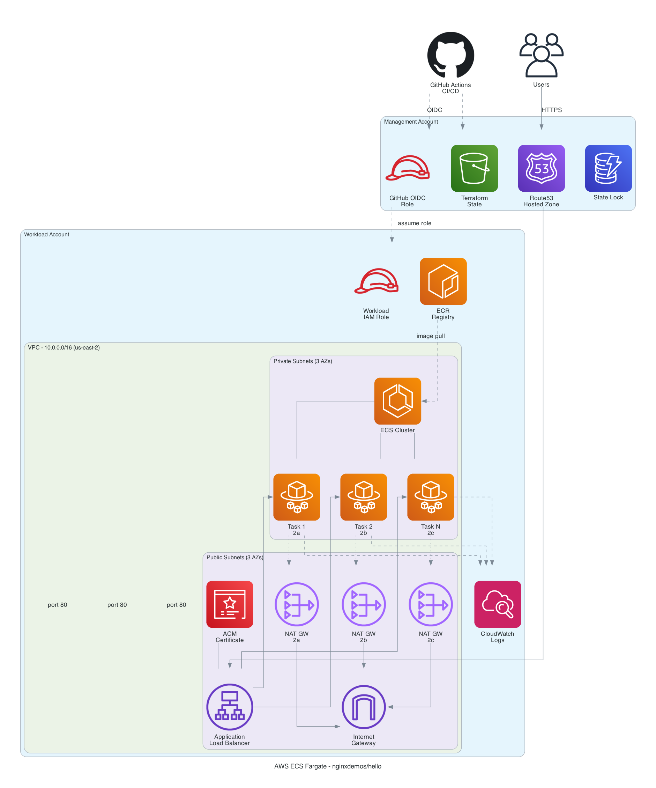

# AWS ECS Fargate Infrastructure - nginxdemos/hello

Terraform infrastructure to deploy the [nginxdemos/hello](https://hub.docker.com/r/nginxdemos/hello/) container on AWS ECS Fargate behind an Application Load Balancer with HTTPS, auto-scaling, and multi-account separation.

## Architecture Overview



### Key Design Decisions

- **ECS Fargate** over EKS — simpler for stateless containers, no cluster management overhead; at the same time, less overhead by not having to manage plain EC2 instances and ASGs, as with EC2 launch type (within ECS or not)
- **Multi-account** — Management account (Terraform state, OIDC, Route53 DNS) + Workload account (compute infrastructure)
- **Cross-account Route53** — Dual Terraform provider: ACM cert + ALB in workload account, DNS records in management account
- **GitHub Actions with OIDC** — no long-lived AWS credentials, keyless authentication
- **3 NAT Gateways** (1 per AZ) — full high availability for outbound traffic
- **HTTPS enforced** — ACM certificate with Route53 DNS validation, HTTP redirects to HTTPS
- **Auto-scaling** — Min 2 tasks, Max 20, target 70% CPU utilization

### Infrastructure Components

| Component        | Details                                                  |
| ---------------- | -------------------------------------------------------- |
| **Region**       | us-east-2 (Ohio)                                         |
| **VPC**          | 10.0.0.0/16 with public + private subnets across 3 AZs   |
| **ALB**          | Internet-facing, HTTPS (TLS 1.3), HTTP→HTTPS redirect    |
| **ECS Fargate**  | 256 CPU / 512 MiB per task, awsvpc network mode          |
| **ECR**          | Private registry, image scanning on push                 |
| **Auto-scaling** | Target tracking on CPU (70%), cooldown 60s out / 300s in |

## Repository Structure

```
.
├── bootstrap/
│   ├── management/          # S3 state bucket, DynamoDB lock, OIDC provider, IAM role
│   └── workload/            # Cross-account IAM role for CI/CD
├── modules/
│   ├── vpc/                 # VPC, subnets, IGW, NAT gateways, route tables
│   ├── security-groups/     # ALB and ECS security groups
│   ├── acm/                 # ACM certificate with Route53 DNS validation
│   ├── alb/                 # ALB, listeners, target group, Route53 alias record
│   ├── ecr/                 # ECR repository with lifecycle policy
│   ├── iam/                 # ECS task execution role and task role
│   └── ecs/                 # ECS cluster, service, task definition, auto-scaling
├── environments/
│   └── production/          # Root module composing all modules
├── .github/workflows/
│   ├── terraform-plan.yml   # PR → terraform plan + comment on PR
│   ├── terraform-apply.yml  # Push to master → terraform apply
│   └── ecr-sync.yml         # Mirror nginxdemos/hello to ECR
└── diagrams/
    └── architecture.py      # Architecture diagram (Python, mingrammer/diagrams)
```

## How to Use This Repository

```bash
# Clone the repository
git clone https://github.com/xperrotti/sample-ecs-nginx-deploy.git
cd sample-ecs-nginx-deploy

# Review and set your configuration
cp environments/production/terraform.tfvars.example environments/production/terraform.tfvars
# Edit terraform.tfvars with your AWS account IDs, domain, and role ARNs
```

Then follow the [Quick Start](#quick-start) below to bootstrap the AWS accounts, configure GitHub secrets, and deploy.

## Prerequisites

- **Two AWS accounts** in an AWS Organization (management + workload)
- **A registered domain** with a Route53 hosted zone in the management account
- **AWS CLI** configured with admin access to both accounts
- **Terraform** >= 1.5.0
- **GitHub repository** with Actions enabled
- **Python 3.9+** and **Graphviz** (optional, for architecture diagram)

## Quick Start

### 1. Bootstrap the Management Account

```bash
cd bootstrap/management
cp terraform.tfvars.example terraform.tfvars
# Edit terraform.tfvars with your values
terraform init
terraform apply
```

This creates: S3 state bucket, DynamoDB lock table, GitHub OIDC provider, and GitHub Actions IAM role.

Save the outputs — you'll need them for the next steps.

### 2. Bootstrap the Workload Account

```bash
cd bootstrap/workload
cp terraform.tfvars.example terraform.tfvars
# Edit terraform.tfvars with the management account ID
terraform init
terraform apply
```

This creates the cross-account IAM role that GitHub Actions will assume.

### 3. Configure GitHub Secrets

Add the following secrets to your GitHub repository (Settings → Secrets and variables → Actions):

| Secret           | Value                                                           |
| ---------------- | --------------------------------------------------------------- |
| `AWS_ROLE_ARN`   | Management account GitHub Actions role ARN (from step 1 output) |
| `TF_STATE_BUCKET`| S3 state bucket name (from step 1 output)                       |
| `TF_LOCK_TABLE`  | DynamoDB lock table name (from step 1 output)                   |

### 4. Configure Terraform Variables

```bash
cd environments/production
cp terraform.tfvars.example terraform.tfvars
# Edit terraform.tfvars with your values
```

Key variables to set:
- `workload_role_arn` — Workload account role ARN (from step 2 output)
- `domain_name` — Your application domain (e.g., `nginx-demo.ciphercoat.com`)
- `hosted_zone_name` — Your Route53 hosted zone (e.g., `ciphercoat.com`)

### 5. Deploy Infrastructure

Push to `master` to trigger the Terraform Apply workflow:

```bash
git add -A
git commit -m "Initial infrastructure"
git push origin master
```

The GitHub Actions workflow will create all infrastructure in the workload account.

### 6. Sync Container Image

After the infrastructure is created, trigger the ECR sync workflow manually:

1. Go to **Actions** → **Sync Docker Image to ECR** → **Run workflow** (select the option to force the ECR deployment to be restarted with the new image)
2. This pulls `nginxdemos/hello` from Docker Hub, pushes it to ECR, and forces an ECS deployment

### 7. Verify

Visit `https://nginx-demo.ciphercoat.com` — you should see the nginxdemos/hello page showing the server address and hostname. Refreshing should show different task IDs (HA across AZs).

## Security

### Network Security
- ECS tasks run in **private subnets** with no public IP addresses
- ECS security group accepts traffic **only from the ALB** security group on port 80
- ALB is the only internet-facing component, accepting ports 80 (redirect) and 443 (HTTPS)
- NAT gateways provide outbound-only internet access for image pulls and log shipping

### Authentication & Authorization
- **No long-lived credentials** — GitHub Actions authenticates via OIDC federation
- OIDC trust is scoped to a specific GitHub repository
- Cross-account access uses IAM role assumption with least-privilege policies
- ECS task role is minimal (nginx doesn't require AWS API access)

### Data Protection
- HTTPS enforced with modern TLS policy (TLS 1.3)
- Terraform state encrypted at rest (S3 SSE-AES256)
- S3 state bucket has all public access blocked
- ECR images scanned on push

### Options for Securing Access to the Web Application

The current deployment exposes the ALB publicly on ports 80/443. Depending on the access requirements, the following options can restrict who can reach the application:

| Option                              | Use Case                                            | Implementation                                                                                                                                                             |
| ----------------------------------- | --------------------------------------------------- | -------------------------------------------------------------------------------------------------------------------------------------------------------------------------- |
| **AWS WAF**                         | Public-facing app needing L7 protection             | Attach WAF WebACL to the ALB with managed rule groups (OWASP Core, Bot Control, IP reputation). Supports rate limiting, geo-blocking, and custom rules.                    |
| **ALB + Cognito / OIDC**            | Internal app with SSO                               | Add an `authenticate-oidc` or `authenticate-cognito` action to the ALB HTTPS listener. Users must sign in before reaching the app — no application code changes required.  |
| **IP Allowlisting**                 | Access restricted to known networks (offices, VPNs) | Add a WAF IP set rule or restrict the ALB security group ingress to specific CIDR ranges instead of `0.0.0.0/0`.                                                           |
| **CloudFront + Signed URLs**        | CDN with controlled access                          | Place CloudFront in front of the ALB with an origin access policy, restrict the ALB to CloudFront-only IPs, and use signed URLs or signed cookies for time-limited access. |
| **AWS Private Link / Internal ALB** | No public exposure needed                           | Change the ALB scheme to `internal` and access it through VPN, Direct Connect, or VPC peering. Eliminates internet exposure entirely.                                      |
| **mTLS (Mutual TLS)**               | Machine-to-machine or high-trust clients            | Use ACM Private CA to issue client certificates and enable mutual TLS on the ALB. Only clients presenting a valid certificate can connect.                                 |

These options are composable — for example, WAF + Cognito provides both L7 protection and user authentication.

### Observability & Threat Detection
- **VPC Flow Logs** — enable on the VPC for network traffic auditing and anomaly detection
- **GuardDuty** — AWS managed threat detection for account-level and network-level threats
- **CloudWatch Container Insights** — already enabled on the ECS cluster for CPU/memory/network metrics

## CI/CD Workflow

| Event                    | Workflow              | Action                                                     |
| ------------------------ | --------------------- | ---------------------------------------------------------- |
| Pull Request to `master` | `terraform-plan.yml`  | Runs `terraform plan` and posts the output as a PR comment |
| Push to `master`         | `terraform-apply.yml` | Runs `terraform apply -auto-approve`                       |
| Manual / Weekly schedule | `ecr-sync.yml`        | Mirrors `nginxdemos/hello` from Docker Hub to ECR          |

## Architecture Diagram

To regenerate the architecture diagram:

```bash
# Install dependencies
brew install graphviz  # macOS
cd diagrams
pip install -r requirements.txt
python architecture.py
```

This produces `diagrams/architecture.png`.

## Destroying Infrastructure

To tear down all infrastructure:

```bash
cd environments/production
terraform destroy
```

Then destroy the bootstrap resources (in reverse order):

```bash
cd bootstrap/workload && terraform destroy
cd bootstrap/management && terraform destroy
```

Note: The S3 state bucket and DynamoDB table have `prevent_destroy = true`. You'll need to remove this lifecycle rule or manually delete them.
